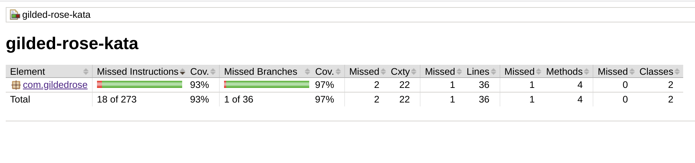

# Day one

We offer our services to the Gilded Rose company.

We took a look at the [requirements](https://github.com/emilybache/GildedRose-Refactoring-Kata/blob/main/GildedRoseRequirements.txt) and we have been told that the application just works, there's even a test!

We get our gradle project and we run 

```bash
./gradlew :test
```

And the build ended up successfully with the output
```
BUILD SUCCESSFUL in 702ms
3 actionable tasks: 1 executed, 2 up-to-date
```


But how much of the code are those test covering?

## Code Coverage 

Let's include the [jacoco plugin](https://docs.gradle.org/current/userguide/jacoco_plugin.html) in our `build.gradle`

```
plugins {
    id 'java'
    id 'jacoco'
}
```
and configure it
```
jacocoTestReport {
    reports {
        xml.required = false
        csv.required = false
        html.outputLocation = layout.projectDirectory.dir('./reports/jacoco')
    }
    dependsOn test // tests are required to run before generating the report
}
```
for convenience we save the reports in a top level root.

After executing the _jacocoTestReport_ task we can see the report in the `reports/jacoco` folder.

The results are quite good.

