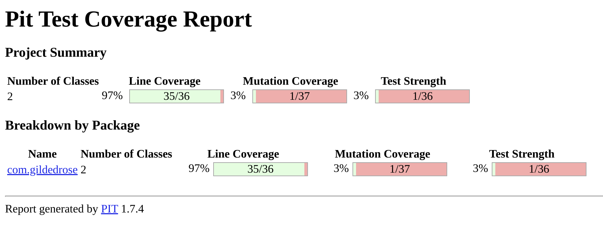

#Day 02

Ok, we have a good coverage, but coverage is not all.

If there is no assertion in a test, the code appear to be covered,but noting really confirms it.

Luckily exists a practice called _Mutation Testing_ and we are going to use the [Pitest](https://pitest.org/) library.

## Adding PITest

update the plugins in the `build.gradle`

```gradle
plugins {
    id 'java'
    id 'jacoco'
    id 'info.solidsoft.pitest' version '1.7.4'
}
```

and update its configuration
```gradle
pitest{
    useClasspathFile = true
    timestampedReports = false
    junit5PluginVersion = '0.15'
    reportDir = layout.projectDirectory.dir('./reports/pitest')
}
```

now we can execute the `pitest` gradle task.

Unfortunately the metrics are nt as good as the coverage was suggesting.

```
- Mutators
================================================================================
> org.pitest.mutationtest.engine.gregor.mutators.ConditionalsBoundaryMutator
>> Generated 10 Killed 1 (10%)
> KILLED 1 SURVIVED 9 TIMED_OUT 0 NON_VIABLE 0 
> MEMORY_ERROR 0 NOT_STARTED 0 STARTED 0 RUN_ERROR 0 
> NO_COVERAGE 0 
--------------------------------------------------------------------------------
```

only one mutant has been killed, the assertion in the test are weak.
