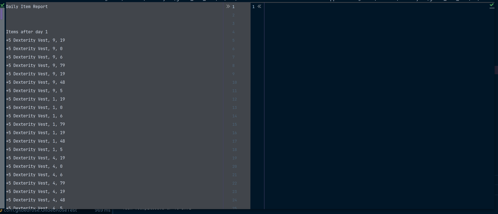
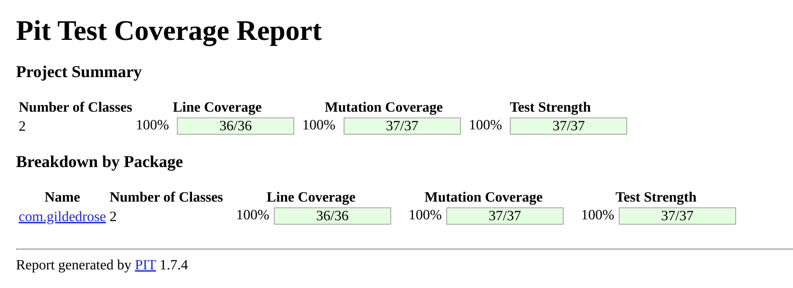

#Day 02

Ok, we have a good coverage, but coverage is not all.

If there is no assertion in a test, the code appear to be covered,but noting really confirms it.

Luckily exists a practice called _Mutation Testing_ and we are going to use the [Pitest](https://pitest.org/) library.

## Adding PITest

update the plugins in the `build.gradle`

```gradle
plugins {
    id 'java'
    id 'jacoco'
    id 'info.solidsoft.pitest' version '1.7.4'
}
```

and update its configuration
```gradle
pitest{
    useClasspathFile = true
    timestampedReports = false
    junit5PluginVersion = '0.15'
    reportDir = layout.projectDirectory.dir('./reports/pitest')
}
```

now we can execute the `pitest` gradle task.

Unfortunately the metrics are nt as good as the coverage was suggesting.

```
- Mutators
================================================================================
> org.pitest.mutationtest.engine.gregor.mutators.ConditionalsBoundaryMutator
>> Generated 10 Killed 1 (10%)
> KILLED 1 SURVIVED 9 TIMED_OUT 0 NON_VIABLE 0 
> MEMORY_ERROR 0 NOT_STARTED 0 STARTED 0 RUN_ERROR 0 
> NO_COVERAGE 0 
--------------------------------------------------------------------------------
```
    
only one mutant has been killed, the assertion in the test are weak.


## Snapshot testing

Snapshot testing is a good technique to make assertions. It allows you to define a golden master that should be compared with the test results.

The library that we are going to use is [ApprovalTest](https://github.com/approvals/ApprovalTests.Java).

`build.gradle`
```
dependencies {
    testImplementation 'org.junit.jupiter:junit-jupiter-api:5.8.2'
    testImplementation 'org.junit.jupiter:junit-jupiter-params:5.8.2'
    testImplementation 'org.junit.jupiter:junit-jupiter-engine:5.8.2'
    testImplementation("com.approvaltests:approvaltests:15.1.2")
}
```

Now to get the test to verify what matters.

Checking the test we get the following lists

* **Items**: _"+5 Dexterity Vest", "Aged Brie", "Elixir of the Mongoose", "Sulfuras, Hand of Ragnaros", "Backstage passes to a TAFKAL80ETC concert"_
* **SellIns**: _10, 2, 5, 0, -1, 15, 3);_
* **Qualities**: _20, 0, 7, 80, 20, 49, 6);_

This can allow us to generate an array of items that will cover all combinations.

Now we need a method that will help us serialize the item array into some comparable string

```java
private String itemToString(Item[] itemsList) {
        return Arrays.stream(itemsList)
        .map(Objects::toString)
        .collect(Collectors.joining(System.lineSeparator()));
}
```

With the lists and the method above our test can now look like this:

```java
    @Test
    void verificationTest() {
        List<String> itemNames = Arrays.asList(
                "+5 Dexterity Vest",
                "Aged Brie",
                "Elixir of the Mongoose",
                "Sulfuras, Hand of Ragnaros",
                "Backstage passes to a TAFKAL80ETC concert"
        );
        List<Integer> sellIns = Arrays.asList(10, 2, 5, 0, -1, 15, 3);
        List<Integer> qualities = Arrays.asList(20, 0, 7, 80, 20, 49, 6);
        Item[] itemsList = itemNames.stream()
                .flatMap(name -> sellIns.stream()
                        .flatMap(sellIn -> qualities.stream()
                                .map(quality -> 
                                        new Item(name, sellIn, quality))))
                .toArray(Item[]::new);
        GildedRose app = new GildedRose(itemsList);

        Approvals.verifyAll("Daily Item Report", IntStream.range(1, 15).mapToObj(Integer::new).toArray(), day -> {
            app.updateQuality();
            return "Items after day " + day + System.lineSeparator() + itemToString(itemsList);
        });        
    }
```

The first execution of this test will fail, because we have not yet defined what is the approved result.



Since we haven't yet touched the code and the owner says that the application is working as expected, we can approve the first result without too much stress.

So we copy all the content from `GildedRoseTest.verificationTest.received.txt` to `GildedRoseTest.verificationTest.approved.txt`

Now we run our pitest again.



Now we have the confidence that any changes we can do to the program we will catch problems